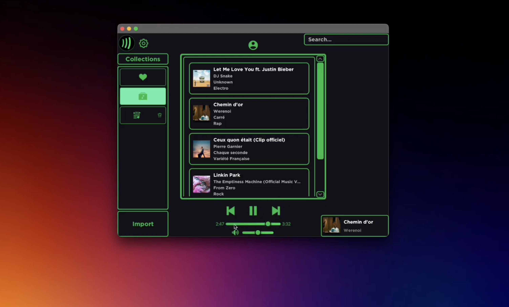
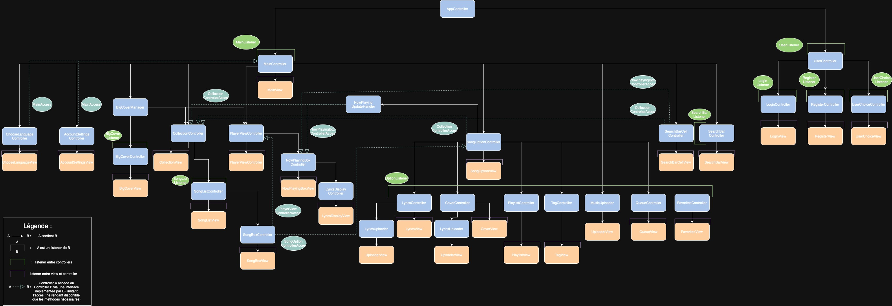

# Deezify

Team Members : Thomas JOSEPHY - Mikael TOM - Noé DEPAEPE - Franklin FLAMENT - Jakub KRZYSZTON - Maria-Erietta TSOUKALOU - Sacha PONCELET - Louis DENIS - Rosario LO CASCIO

Date : 12/05/2025



## About the Project
Deezify is a modern, versatile music player designed to let users manage, organize, and enjoy
their music smoothly: building playlists, browsing tracks by tags, or simply enjoying an
immersive listening experience with custom audio effects. It combines ease of use with more
advanced features such as tag management, synchronized lyrics, and a karaoke mode.

This project was developed as part of the **INFO-F-307, Software Engineering and Project
Management** (Génie logiciel et gestion de projets) course at the **Université Libre de Bruxelles (ULB)**, academic year 2024-2025.


[Click here to see the full video on YouTube.](https://youtu.be/WWFQLCM41m4)

## Methodology
 
The project was carried out using the **Extreme Programming (XP)** methodology, over **4
iterations of two weeks each** (excluding academic breaks), running from February 18, 2025 to
May 12, 2025. For every iteration, the group delivered a working version of the application
together with updated documentation (user stories, task repartition, burndown chart, and design
notes), and presented a short demo to the course assistants, who acted as the project's clients.
 
Development followed a **Test-Driven Development (TDD)** approach: writing code was
alternated with writing unit tests, and all tests had to pass before moving forward. Regression
tests were also written for every bug encountered, to make sure the same issue would never have
to be solved twice. **Git** was used throughout the project for version control, with a shared
GitLab repository and continuous integration running the test suite on every push.


## Architecture
 
Deezify is built around an **enhanced MVC (Model-View-Controller)** architecture:
 
- **Model**: handles the data and business logic (songs, playlists, etc.), and is only ever manipulated by controllers through dedicated services.
- **View**: handles display and user interaction. It contains no business logic and communicates with its controller exclusively through `Listener` interfaces.
- **Controller**: the bridge between view and model. It initializes and manages its associated view, reacts to user actions received through the `Listener` interface, and relies on services to update the model.
On top of this, the codebase relies on a few key design choices to keep things clean, testable,
and modular:



- **Services & Repositories**: most singletons were removed in favor of a service layer (business logic) and a repository layer (database access), making components far easier to test and reason about. Only two singletons remain: `SQLService` (a single shared database connection) and `ImageCache` (centralized image loading/caching for performance).
- **Listener interfaces**: views only ever depend on an interface, never on a concrete controller implementation, keeping coupling low and views easy to test in isolation.
- **DTOs (Data Transfer Objects)**: used to pass read-only data from the model to the views, preventing views from ever mutating the model directly.
- **Immutable collections**: used in several places to safely share lists of objects with the views.
- **Database triggers**: used to automate certain actions (e.g. automatically creating the "Library" and "Favorites" playlists when a user is created, or adding a new song to the "Library" playlist as soon as it's added to the database), reducing boilerplate code.
- **Internationalization**: implemented with Java's standard `ResourceBundle` mechanism and
`.properties` files, wrapped in a dedicated `LanguageService` and an `I18n` utility class, making it straightforward to add new languages.

For the full write-up of these choices, the technical difficulties encountered during each
iteration and how they were solved, see [`team/ProjectExplanation.md`](team/ProjectExplanation.md).


## User stories
 
The application was built around a set of user stories, refined together with the clients
(course assistants) and delivered progressively across the four iterations:
 
**Iteration 1**
- Story 1: Browse and play tracks stored on the computer
- Story 3: Playback control buttons (progress slider, pause/next/previous, volume)
- Story 4: Edit a track's metadata (artist, title, album)
- Story 6: Add predefined and custom tags to tracks
- Story 7: Search tracks by title, artist, album, or tags
- Bonus: Profanity filter for user-created tags
**Iteration 2**
- Story 2: Playback queue (add/remove tracks, auto-play next, clear queue)
- Story 8: Playlists (create, reorder tracks via drag & drop, delete)
- Story 13: Import and display lyrics for a track
- Story 19: Import and display album covers
- Refinements to Stories 1, 4 and 6
**Iteration 3**
- Story 14: Karaoke mode with synchronized, scrolling lyrics
- Story 21: Default "Favorites" playlist
- Bonus: Find a track by searching its lyrics in the search bar
- General code refactor
**Iteration 4**
- Story 18: Multilingual support (French, Dutch, English), tied to the user's account
- Story 22: Local user accounts, each with their own playlists
- Bonus: Password-protected accounts, with a "stay logged in" option
- Bonus: Resizable application window
- General code refactor

For the complete list of user stories, their client priority, developer risk, and final point
estimation, see [`team/UserStoriesPoints.md`](team/UserStoriesPoints.md).


## Prerequisites

- **Java**: Minimum required version is 21.

## Dependencies

This project uses the following dependencies:

- **JUnit 5** for testing.
- **JavaFX** for the graphical user interface.
- **SQLite JDBC** for managing the SQLite database.
- **JLayer** for handling MP3 audio files.

## Compile and run

To build and run the project, use the following commands:

```bash
mvn compile
mvn exec:java
```

or you can use the following command:

```bash
make
```

## Test

To run the tests, use the following commands:

```bash
mvn compile
mvn test
```

## Run .jar file

To run the .jar, firstly, download the JavaFX
21.0.6 [(https://gluonhq.com/products/javafx/)](https://gluonhq.com/products/javafx/)

then use the following command (by replacing YOUR_PATH_TO_JAVAFX by your actual path):

```bash
java --module-path YOUR_PATH_TO_JAVAFX/lib --add-modules javafx.controls,javafx.fxml,javafx.media -jar iteration4.jar 
```

For example, if your path to JavaFX 21.0.6 is `~/Downloads/javafx-sdk-21.0.6/lib`

```bash
java --module-path ~/Downloads/javafx-sdk-21.0.6/lib --add-modules javafx.controls,javafx.fxml,javafx.media -jar iteration4.jar 
```

# Javadoc Documentation

You can access the Javadoc documentation by opening the `.html` files in `target/site/apidocs/`

To generate the javadoc, you can use the following command:

```bash
mvn javadoc:javadoc -DadditionalJOption=-Xdoclint:none
```

## Team work

All documents related to the team are in [`team/`](team). You can find the following documents:

- [`ProjectExplanation.md`](team/ProjectExplanation.md) : A document detailing project tracking, feature implementation,
  technical challenges, and key design decisions, including main design patterns.
- [`BurndownChart.ods`](team/BurndownChart.ods): Burndown chart updated
- [`TasksRepartition.md`](team/TasksRepartition.md): File detailing the distribution of developer tasks for completed
  iterations.
- [`UserStoriesPoints.md`](team/UserStoriesPoints.md): Updated user stories with content details and point estimations.

## Application Demonstration
This [video](https://youtu.be/WWFQLCM41m4) demonstrates the main features of the application and provides an overview of the architecture.
